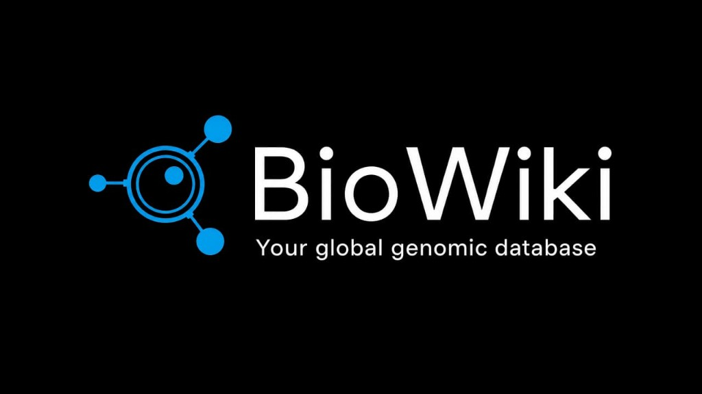

# BioWiki

BioWiki is a local biological sequence database: PostgreSQL stores the records, FastAPI serves them, and a Next.js interface is used to browse DNA, RNA, proteins, CRISPR guides, viruses, genome assemblies, organisms, and linked publications.

It is a catalogue and query system for real accessions from public databases. It is not a clinical diagnostic tool and it does not invent sequences.

**Status:** local 0.1.0. The application code is MIT-licensed. Sequence records remain under the terms of their originating databases.

**Stack:** Next.js 15, React 19, TypeScript, FastAPI, SQLAlchemy, PostgreSQL. The UI background uses Three.js.

---

## About

Records enter the database only through an **operator CLI**. The HTTP API is read-only (`GET`). The web app talks to `/api/v1`. Scientific data lives in PostgreSQL, not in this Git repository.

This local instance currently holds:

| Resource | Count |
| --- | ---: |
| Sequences | 1542 |
| — DNA | 689 |
| — RNA | 307 |
| — Protein | 327 |
| — CRISPR | 79 |
| — Virus | 140 |
| Publications | 5838 |
| Organisms | 454 |
| Genome assemblies | 32 |

Counts come from the live database, not from files in Git. They change when the CLI imports more records.

---

## Features

- Browse DNA, RNA, proteins, CRISPR guides, viruses, organisms, and genome assemblies
- Record pages by accession, with residues and source metadata
- Publications linked to sequences (PubMed identifiers)
- Full-text search and autocomplete (`/search`)
- Filters, cursor pagination (`nextCursor`)
- Live aggregates (`/statistics`)
- Exports in FASTA, CSV, JSON, and GenBank
- FastAPI OpenAPI UI at http://127.0.0.1:8000/docs when the API is running

---

## Data sources

Connectors used by the CLI (not by public HTTP routes):

| Source | Role |
| --- | --- |
| [NCBI](https://www.ncbi.nlm.nih.gov/) GenBank / RefSeq | Nucleotide and protein records (E-utilities) |
| [NCBI Datasets](https://www.ncbi.nlm.nih.gov/datasets/) | Genome assemblies |
| [PubMed](https://pubmed.ncbi.nlm.nih.gov/) | Article metadata and sequence links |
| [UniProt](https://www.uniprot.org/) | Protein records |
| [Ensembl](https://www.ensembl.org/) | Annotated sequences |
| [RCSB PDB](https://www.rcsb.org/) | Structure-linked polymer sequences |
| [ENA](https://www.ebi.ac.uk/ena/) | Nucleotide records (EMBL-EBI) |
| [Rfam](https://rfam.org/) | RNA family members (resolved via NCBI for sequence text) |

The site footer also mentions DDBJ as a public sequence archive. There is **no DDBJ connector**.

---

## Architecture

```text
NCBI / UniProt / Ensembl / PDB / ENA / Rfam / PubMed / Datasets
                         │
                         │  python -m app.pipeline.cli
                         ▼
                    PostgreSQL
                         │
                         ▼
                 FastAPI  (:8000)
                   /api/v1
                         │
                         ▼
                 Next.js  (:3000)
```

Ingestion is **CLI-only**. There is no HTTP import endpoint.

---

## Project structure

```text
backend/app/          FastAPI application, ORM, search, connectors, CLI pipeline
backend/scripts/      seed and maintenance scripts
backend/tests/        pytest suite
frontend/src/        Next.js App Router UI
assets/branding/     Official lockup (icon + wordmark)
```

---

## Requirements

- PostgreSQL (this project is run against 17)
- Python 3 (developed on 3.14; see `backend/requirements.txt`)
- Node.js (developed on 24; see `frontend/package.json`)

There is no Docker setup in this repository.

The repository does not ship a PostgreSQL dump or Alembic migrations. The SQLAlchemy models in `backend/app/models/` describe the tables. The live database also has a `sequences.search_vector` column used by `/search` (not declared on the ORM class). A clone needs an empty `biowiki` database whose schema matches that running instance, then CLI ingest. The Git tree does not contain the sequence corpus.

### What you need vs what is optional

**Required to run the catalogue** (browse an existing database): PostgreSQL with a `biowiki` database, Python dependencies from `backend/requirements.txt`, Node dependencies from `frontend/package.json`. NCBI, UniProt, and the other archives are **not** required for `uvicorn` or `npm run dev` once records are already in PostgreSQL.

**Required only to import records:** network access to the source used by that CLI command (NCBI E-utilities / Datasets, UniProt, Ensembl, PDB, ENA, Rfam, PubMed). Ingestion is CLI-only (`python -m app.pipeline.cli`); there is no HTTP import route.

**Optional:** `CONNECTOR_NCBI_API_KEY` and `CONNECTOR_NCBI_EMAIL` (higher NCBI rate). `API_KEYS` (lock the HTTP API). Without those, the local API stays open and NCBI calls use the anonymous rate.

---

## Running locally

### 1. PostgreSQL

Create a database named `biowiki` and a role the API can use. Point `DATABASE_URL` at it (asyncpg URL).

### 2. Backend

```bash
cd backend
python -m venv .venv
```

Windows: `.venv\Scripts\activate`  
Unix: `source .venv/bin/activate`

```bash
pip install -r requirements.txt
cp .env.example .env   # Windows: copy .env.example .env
```

Edit `.env`: set `DATABASE_URL`. Leave `API_KEYS` empty for an open local API.

```bash
python -m uvicorn app.main:app --host 127.0.0.1 --port 8000
```

- API: http://127.0.0.1:8000/api/v1
- OpenAPI: http://127.0.0.1:8000/docs

Optional first load of curated real accessions (requires network access to the sources):

```bash
python -m scripts.seed_initial
```

Further imports, from `backend/`:

```bash
python -m app.pipeline.cli ncbi --accessions NM_000207.3
python -m app.pipeline.cli uniprot --accessions P01308
python -m app.pipeline.cli --help
```

### 3. Frontend

```bash
cd frontend
cp .env.example .env.local   # Windows: copy .env.example .env.local
npm install
npm run dev
```

UI: http://localhost:3000  
Copy `frontend/.env.example` to `.env.local` so `NEXT_PUBLIC_API_URL` is `http://localhost:8000/api/v1`. Without that file the UI skips API calls and shows empty, honest states.

---

## Configuration

| File | Purpose |
| --- | --- |
| `backend/.env` | Copied from `backend/.env.example`. Not committed. |
| `frontend/.env.local` | Copied from `frontend/.env.example`. Not committed. |

Backend variables actually used include `DATABASE_URL`, `CORS_ORIGINS`, `BIOWIKI_ENV`, `RATE_LIMIT_*`, and optional `API_KEYS`. Optional `CONNECTOR_NCBI_API_KEY` / `CONNECTOR_NCBI_EMAIL` raise the allowed NCBI request rate. Do not commit filled env files.

---

## API

Base path: **`/api/v1`**. JSON uses camelCase. Sequence, protein, virus, genome and publication lists return `{ results, total, nextCursor }`. Organism lists return `{ organisms, total, nextCursor }`.

| Method | Path | Notes |
| --- | --- | --- |
| GET | `/health`, `/ready` | Liveness / DB probe |
| GET | `/sequences` | Requires `type=dna\|rna\|crispr` |
| GET | `/rna`, `/crispr` | Category lists |
| GET | `/sequences/{accession}` | Single record, including residues |
| GET | `/proteins`, `/proteins/{accession}` | |
| GET | `/viruses`, `/viruses/{accession}` | |
| GET | `/organisms`, `/organisms/featured`, `/organisms/{identifier}` | |
| GET | `/genomes`, `/genomes/{accession}` | |
| GET | `/publications`, `/publications/{pubmed_id}` | |
| GET | `/search`, `/search/suggest` | PostgreSQL full-text search |
| GET | `/statistics`, `/statistics/sync`, `/statistics/integrity` | Live aggregates |
| GET | `/download`, `/download/sequences`, `/download/sequence/{accession}` | fasta, csv, json, genbank |

Typical query flags: `q`, `organism`, `source`, `limit` (1–100 on lists; bulk download up to 10 000), `cursor`. If `API_KEYS` is set, send `X-API-Key`.

Interactive schema: `/docs`.

---

## Testing

There is a backend suite only (no frontend test runner).

```bash
cd backend
python -m pytest tests
```

Tests expect a reachable API at `http://127.0.0.1:8000` for HTTP cases, and a live `biowiki` database for integrity checks. They do not write production rows.

---

## Scripts

Run from `backend/` with the virtualenv active. None of these are HTTP routes.

| Command | Purpose |
| --- | --- |
| `python -m app.pipeline.cli` | Import real records from NCBI, UniProt, Ensembl, PDB, ENA, Rfam, PubMed, or a local file |
| `python -m scripts.seed_initial` | First load of curated real accessions |
| `python -m scripts.expand_dataset` | Broader import jobs (checkpoint file is local and not committed) |
| `python -m scripts.backfill_empty_residues` | Fill empty `residues` from official NCBI FASTA when GenBank has CONTIG only |
| `python -m scripts.verify_expansion` | Read-only checks against the live database |

Smoke scripts (`smoke_api.ps1`, `smoke_search.ps1`, `smoke_connectors.py`) are optional local checks.

---

## Scientific data

Accessions, residues, PMIDs, and taxonomy in the running database come from the sources above. This Git tree does not contain the sequence corpus. Re-importing uses the CLI; it does not fabricate missing sequence text.

The MIT license covers BioWiki **software** (application code, tests, documentation in this repository). It does **not** re-license NCBI, UniProt, Ensembl, PDB, ENA, Rfam, or PubMed records. Redistribute those records only under each source’s current terms. BioWiki does not invent a data license.

Public statements from the sources (verify on their sites before redistributing records):

| Source | What they currently state |
| --- | --- |
| [NCBI](https://www.ncbi.nlm.nih.gov/home/about/policies/) | NCBI places no restriction on use/distribution of data in its molecular databases; submitters may still claim IP, and NCBI does not transfer those rights |
| [UniProt](https://www.uniprot.org/help/license) | Copyrightable parts of UniProt databases: CC BY 4.0 |
| [Ensembl](https://www.ensembl.org/info/about/legal/disclaimer.html) | No restriction on Ensembl-generated data; third-party constraints may apply |
| [PDB](https://www.rcsb.org/pages/usage-policy) | PDB archive files: CC0 1.0; attribution of original authors is encouraged |
| [Rfam](https://docs.rfam.org/en/latest/) | Rfam data: CC0 |
| ENA / PubMed | Consult [ENA](https://www.ebi.ac.uk/ena/browser/about) and [NLM](https://www.ncbi.nlm.nih.gov/home/about/policies/) terms for the specific record |

The in-app `/license` page lists public archives for attribution; DDBJ is listed there without a BioWiki connector.

---

## Limitations

- PostgreSQL is required; this repository does not include a data dump or a complete schema migration
- Imports need network access to external APIs and are operator-driven
- The HTTP API does not ingest data
- No Docker / Kubernetes configuration
- Optional API keys; an empty `API_KEYS` list leaves the local API open
- The in-process rate limiter is per server process

---

## References

- [NCBI E-utilities](https://www.ncbi.nlm.nih.gov/books/NBK25501/)
- [NCBI Datasets](https://www.ncbi.nlm.nih.gov/datasets/)
- [UniProt REST](https://www.uniprot.org/help/api)
- [Ensembl REST](https://rest.ensembl.org/)
- [RCSB PDB](https://www.rcsb.org/docs/programmatic-access/web-apis-overview)
- [ENA Browser API](https://www.ebi.ac.uk/ena/browser/api/)
- [Rfam](https://docs.rfam.org/)
- [PubMed](https://pubmed.ncbi.nlm.nih.gov/)

---

## License

Application code in this repository is licensed under the MIT License. See `LICENSE`.

Biological records remain subject to NCBI, UniProt, Ensembl, PDB, ENA, Rfam, and PubMed terms. See **Scientific data** above.

To report a vulnerability after the project is on GitHub, use a private advisory (`SECURITY.md`). Do not file a public issue for credential or database exposure.
